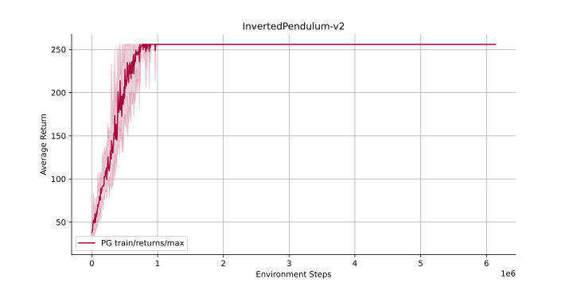
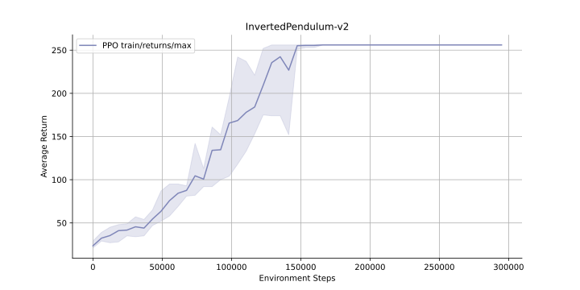

# On Policy Hierarchal RL Algorithms

This package implements on policy reinforcement learning that supports training policies arranged in a graph structure. Two special cases are multi-agent rl and hierarchical rl. Have Fun! -Brandon

# Installation

You may install this package by cloning it from github and using pip.

```
git clone https://github.com/brandontrabucco/on_policy
pip install -e on_policy
```

# Performance

Below is an evaluation of the Policy Gradient implementation on `InvertedPendulum-v2` with a maximum episode length of 256 and a batch size of 6144. The maximum achievable reward is 256.

<p align="center">
    
</p>

Below is an evaluation of the Proximal Policy Optimization implementation on `InvertedPendulum-v2` with a maximum episode length of 256 and a batch size of 6144. The maximum achievable reward is 256.

<p align="center">
    
</p>
